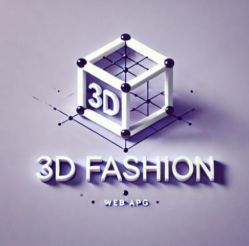

  <a href="https://nextjs-flask-starter.vercel.app/">
    
    <h3 align="center">3D Fashion App</h3>
  </a>

Next.js project that uses <a href="https://flask.palletsprojects.com/">Flask</a> as the API backend.

 

## Introduction

This is a hybrid Next.js + Python app that uses Next.js as the frontend and Flask as the API backend. This project involves building a web app that provides a user-friendly 3D clothes design web application that can be used as a means of sending designs to tailors and sharing to a community of designers. Utilizing an AI-powered body measurement tool, a user's body measurements is used to create a 3D model that reflects their 3D-selves on which they can style and design clothes on and connect with a tailor from the websites platform to get the final outfit.

## Demo
https://nextjs-flask-starter-git-main-damic995s-projects.vercel.app/
